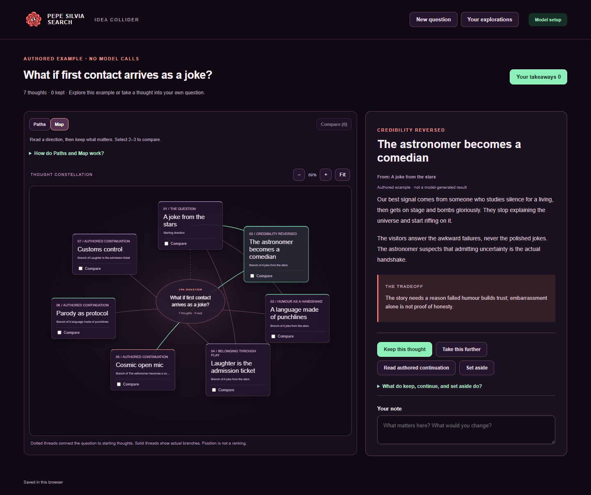

# Pepe Silvia Search

A local workbench for exploring more than one answer. Follow branching ideas, compare alternatives, keep useful thoughts, and write down what changed your mind.



**Status: experimental, single-user software.** Three authored examples work without an account or model. Optional live runs use the original forward-only exploration engine. Model outputs are possibilities to inspect, not verified facts or ranked recommendations.

## Try it

Install Python 3.11+ and [uv](https://docs.astral.sh/uv/getting-started/installation/), then from this repository:

```sh
uv sync --frozen --extra web
uv run pss-web
```

Open **http://127.0.0.1:4311**. Choose an example, switch between Paths and Map, select two thoughts to compare, and keep a thought with your own note. Open **Your takeaways** to export Markdown or a complete JSON workspace. **Import workspace** restores a saved JSON file.

The examples are authored illustrations of the interaction, not recordings of model runs. For a real generated exploration, import [the recorded museum workspace](docs/examples/museum-workspace.json). Its [run note](docs/examples/README.md) explains the prompt, model, timing and limitations.

Browser storage retains your work between visits. Export before clearing browser data. The server keeps only one active live run in memory; browser workspaces retain previously fetched thoughts.

## Connect a model

Examples need no configuration. To generate new directions, copy `.env.example` to `.env` and explicitly enable one provider. See [model setup](docs/SETUP.md) for OpenRouter, Ollama, and a local llama.cpp server. No provider is selected as a fallback when your chosen provider fails.

Live runs allow 2–6 contexts, at most 18 requests, and a five-minute window for starting requests. Cloud calls may incur charges: these limits are not a dollar cap. Stopping prevents subsequent requests; an in-flight request can finish. Partial output remains available.

## What this does well, and what it does not

- Makes alternative directions and their ancestry visible, with full text and side-by-side comparison.
- Keeps your selections, annotations and next move separate from model output.
- Supports a bounded question-and-exploration loop, including pause, resume and stop.
- Does not prove that branching beats ordinary chat or that the ideas are original or correct.
- Is a local personal tool, not a hosted multi-user service. The workbench cannot execute model-proposed commands or read your files as tools. Older research/CLI modules are separate experimental interfaces.

The map shows actual branch relationships. Position is not a relevance or quality score. Setting a thought aside hides it in your view; it does not revive or terminate an engine branch.

## Development

```sh
uv sync --frozen --extra web --extra dev
uv run pytest -q
node --test tests/frontend/*.test.mjs
uv build
```

Node.js 22+ is needed only for frontend tests. The frontend uses native HTML/CSS/JavaScript and needs no package installation or build step. See [verification](docs/VERIFICATION.md) for the checks actually performed and their limits.

## Origins and license

Created under Kyle Menchaca's direction with coding-agent assistance. This public snapshot combines the recovered PSS engine with the September 2026 workbench. [Original experimental source](docs/EXPERIMENTS.md) is retained for context; historical performance summaries are omitted from this release.

MIT for original code and release examples; bundled Lucide icons retain their license. Generated visual assets and the import chronology are documented in [PROVENANCE.md](PROVENANCE.md). The name references a cultural meme; no affiliation is claimed.
