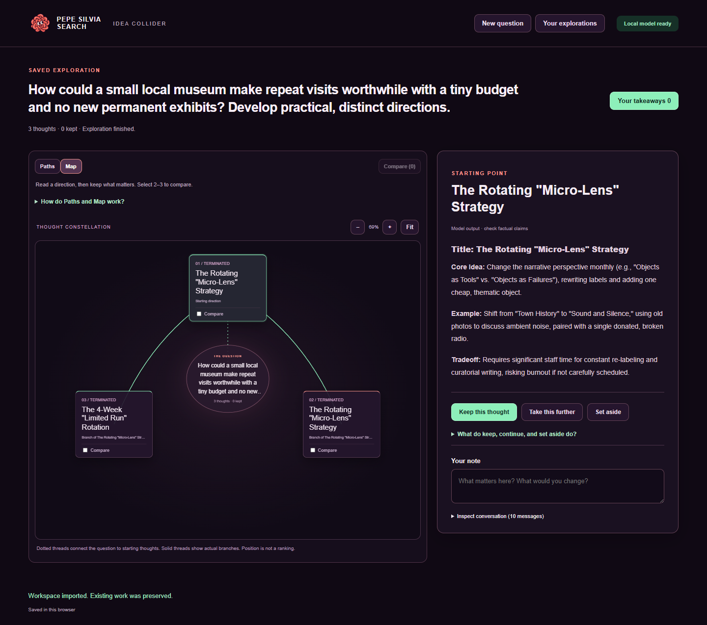

# A real museum exploration

This is an unedited workspace export from a completed local-model run on September 10, 2026. It is separate from the three authored examples bundled in the interface.

## Open it

Download [museum-workspace.json](museum-workspace.json), start PSS, choose **Import workspace**, and select the file. No model is needed to read the saved output. All three thoughts include their complete output and conversation records. The file was downloaded through the browser and re-imported successfully.

## Prompt

> How could a small local museum make repeat visits worthwhile with a tiny budget and no new permanent exhibits? Develop practical, distinct directions.

## Conditions and outcome

- Local llama.cpp server, model alias `qwen38-27b-jonathancoletti-uncensored-mtp-q4km`, running on the existing workstation GPU service.
- Three contexts; 18 requests; 15,582 reported input tokens and 2,608 reported output tokens across requests.
- Final server outcome: complete. No paid cloud calls or fallback provider.
- New public demonstration prompt; no private documents, personal history or commercial data.

The run completed mechanically, but two branches converged on nearly the same monthly reinterpretation idea. The third emphasized a limited-run rotation. The branch brief for community co-creation was not faithfully reflected in its final answer. The museum's staffing, audience and resources were not independently checked.

This is evidence that generation, branching, full-text capture and reopening work. It is also an example of a real limitation: visible branches do not guarantee distinct or better ideas. The output is retained as generated rather than rewritten into a stronger demonstration. No user notes or keep selections were added to the recording.
